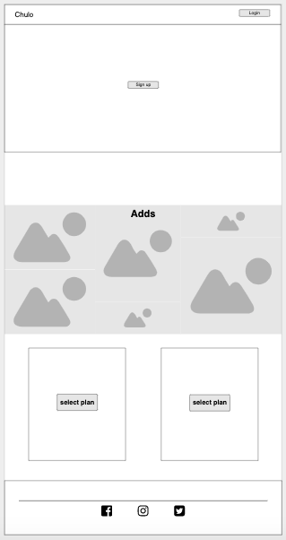
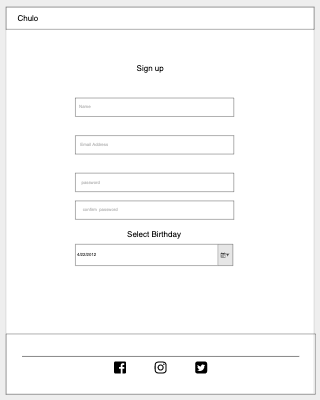
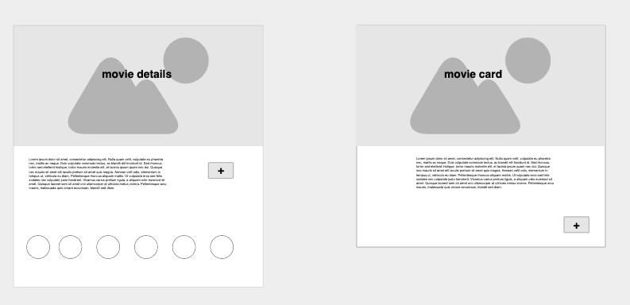
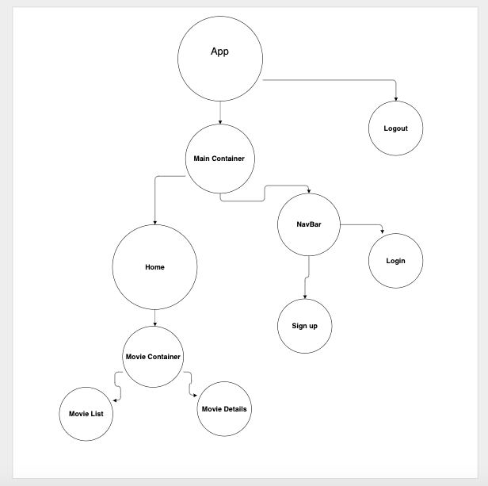
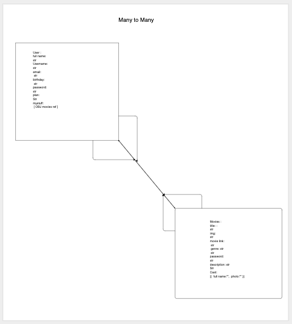

# WatchChulo
[link to the app](https://watchchulo.herokuapp.com/)

## User stories
- User open landing page. 
- If the user have an account they can login.
- If they don’t have an account they need to sign up.
- After sign up, User is redirect to Home. 
- In Home user can see a navbar with ( myMovies, Menu __(stretch goal search bar)__ ).
- User by using the button __√__ they can add the movie to myMovies. 
- To see the movie details the user can use the button __details__.  
- In the dropdown menu the user can access to their account and payment details, __(Edit, Update or delete)__.

## WireFrame / ERD / React Data flow
                                                      |   
 |  
 |   


 
 
 


## Some Code Example

###### RemoveMovie/Controller (Back-end) 
````javaScript
const removeMovie = (req,res) => {
  const deletedMovie = req.params.movieId;
  db.User.findById(req.params.id, (err, foundUser) =>{
    let updatedMovies = foundUser.my_movies.filter( movie => movie._id.toString() !== deletedMovie);
      if (err) return res.status(500).json({
          status: 500,
          error: [{message: 'Uh oh, something went wrong. Please try again'}],
      });
      foundUser.my_movies = updatedMovies;
      foundUser.save((err) => {
          if (err) return res.status(500).json({
              status: 500,
              error: [{message: 'Uh oh, something went wrong. Movie can not be added'}, err],
          });
          return res.status(200).json({
              status: 200,
              data: deletedMovie,
          }); 
      })
  });
}
````

###### RemoveMovie/Component (Front-end)

```javaScript 
// Parent Component
state = {
    userMovies:[],
    loaded: false
  }
  
   handleRemoveMovie = (event, id) => {
    event.preventDefault()
    let resId = id
    axios.put(`${process.env.REACT_APP_API_URL}/users/${this.props.currentUser}/my_movies/${resId}/removemovie`, { withCredentials: true })
    .then(res => {
      if (res.status === 200 ) {
        let updatedMovies = this.state.userMovies.filter( movie => movie._id !== res.data.data)
  
        this.setState({
          userMovies: updatedMovies,
        }) 
      }
    })
    .catch(err => console.log(err));


  // Child Componet
  <button type="button" className={`btn btn-sm btn-outline-secondary ${this.state.addedMovie && "disable"}`}  onClick={(event) => this.props.handleRemoveMovie(event, this.props.movie._id)} >--</button>
  }
``` 

## Next Steps
* __Stream Content__
* Light Theme Mode
* Stripe Payment (__Paypal__ maybe)
* Add and Admin session (*create movies routes works*)
* Search
* [x] Full CRUD Payment
* Rate movies 

## Technology Used
* __Node.js__
* __MongoDB__
* __React__
* __Bootstrap__
* __Heroku__
* __appMoqups__